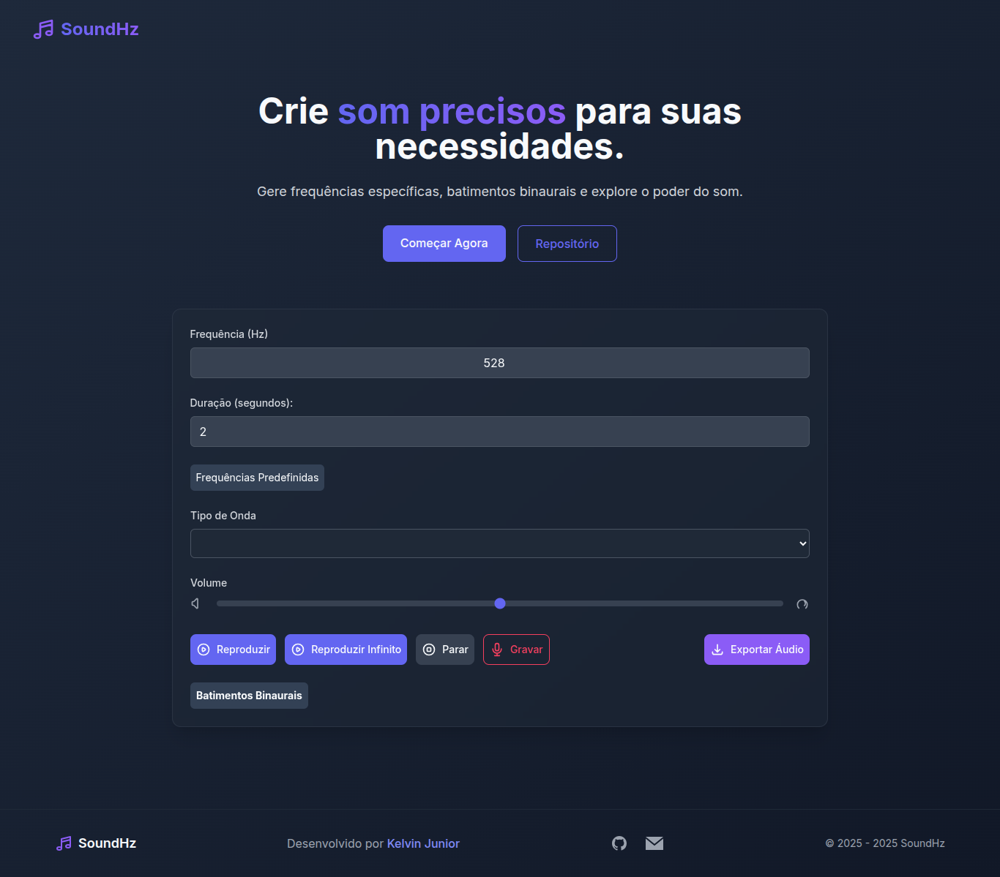

# 🎵 SoundHz

[](LICENSE)
<!-- [](https://web.dev/progressive-web-apps/) 
desenvolvido como PWA (Progressive Web App).-->
[](https://vuejs.org/)

Um gerador de frequências audiáveis completo com visualizador de onda, batimentos binaurais e exportação de áudio.




## ✨ Funcionalidades

- 🔊 Geração de tons de **20Hz a 20kHz**
- 🌗 **4 tipos de onda**: seno, quadrada, serra e triangular
- ⏱️ Controles de **duração** e **reprodução contínua**
- 🎧 **Batimentos binaurais** (combinação de frequências)
- 📊 **Visualizador de onda** em tempo real
- 💾 **Exportação** de áudio em formato WAV
- 🌓 **Tema claro/escuro** toggle
- 📱 **PWA** (instalável em dispositivos móveis/desktop) - brevemente

## 🛠️ Tecnologias Utilizadas

### Frontend


### Build Tools


## 🚀 Instalação

### Pré-requisitos
- Node.js (v16 ou superior)
- npm (v8 ou superior)

### Passo a Passo

1. **Clone o repositório**
   ```bash
   git clone https://github.com/seu-usuario/gerador-tons-hz.git
   cd gerador-tons-hz

npm install
